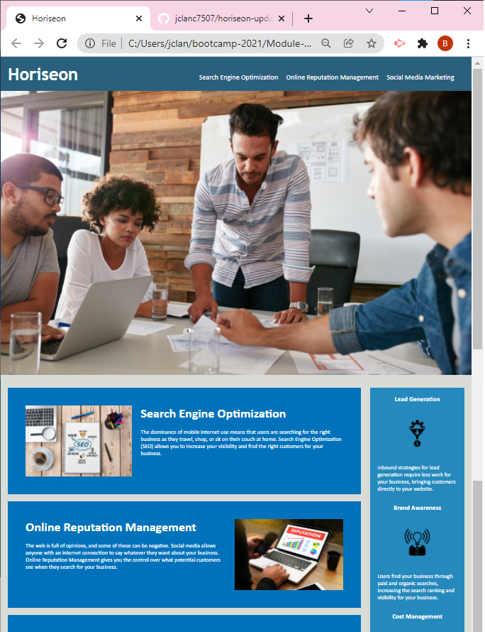

# Horiseon

## What We Offer:

## 1.) Search Engine Optimization (SEO)
The dominance of mobile internet use means that users are searching for the right business as they travel, shop, or sit on their couch at home. Search Engine Optimization (SEO) allows you to increase your visibility and find the right customers for your business.

## 2.) Online Reputation Management
The web is full of opinions, and some of these can be negative. Social media allows anyone with an internet connection to say whatever they want about your business. Online Reputation Management gives you the control over what potential customers see when they search for your business.

## 3.) Social Media Marketing
Social media continues to have a sizable influence on buying habits. Social Media Marketing helps you determine which platforms are suited to your brand, using analytics to find the right markets and increase your lead generation.

### Benefits of Using Horiseon:
A.) Inbound strategies for lead generation require less work for your business, bringing customers directly to your website.

B.) Users find your business through paid and organic searches, increasing the search ranking and visibility for your business.

C.) As the search ranking for your business increases, your advertising costs decrease, and you no longer need to advertise your page.

### Depolyment Web Link:
https://jclanc7507.github.io/horiseon-update/

<!-- Not too sure why my link brings the viewer to the README file. -->

 

<!-- Screenshot is present in assets folder, but does not register in Preview. -->